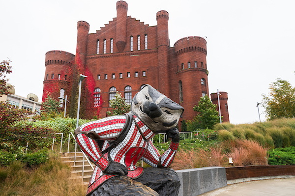
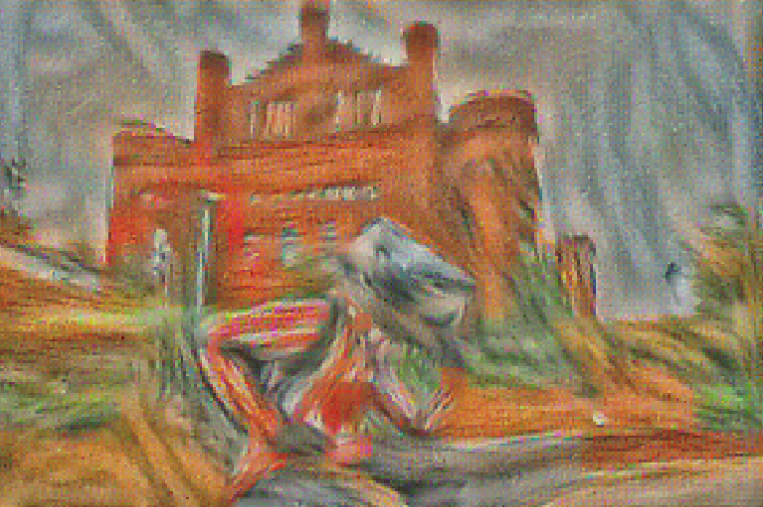
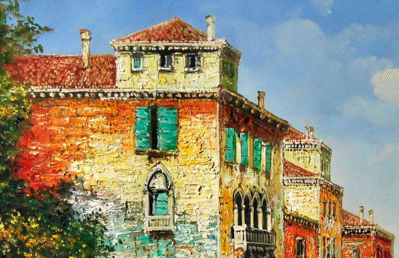
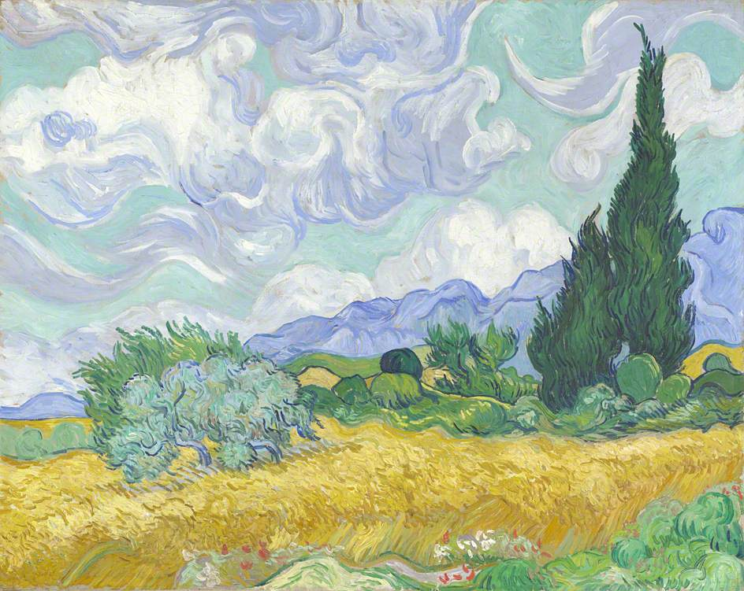
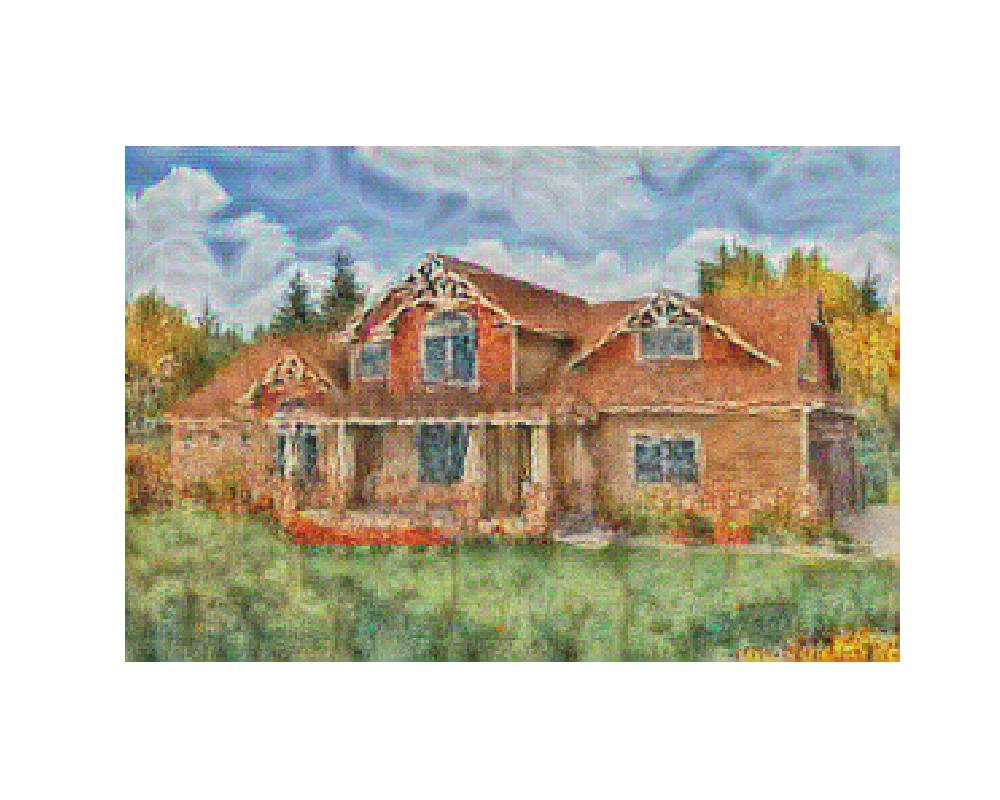
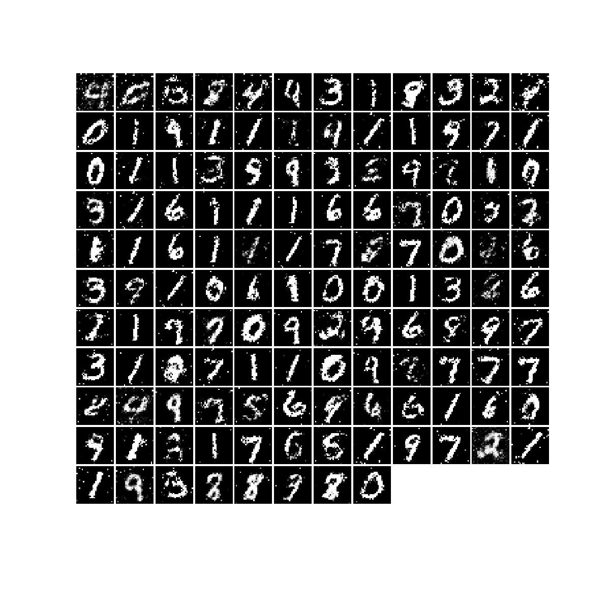
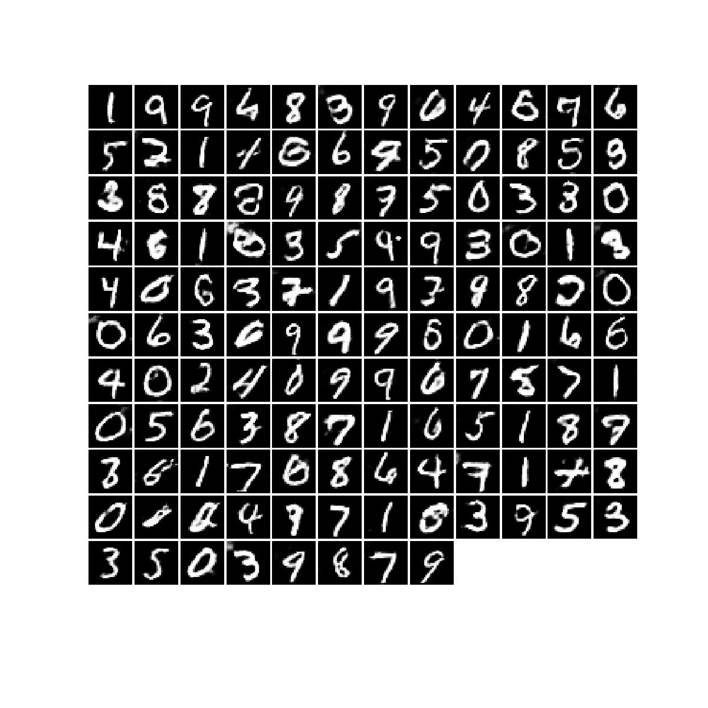

# **Neural Style Transfer & GANs with PyTorch**

## **1. Introduction**
This repository implements two key deep learning techniques using **PyTorch**:
1. **Neural Style Transfer (NST)** – Transfers the artistic style of one image to another while preserving content.
2. **Generative Adversarial Networks (GANs)** – Trains a model to generate realistic images from random noise.

These methods showcase how **deep learning** can generate and manipulate images in creative ways. NST is used for **artistic style transfer**, while GANs are trained to create **synthetic images** that resemble real data.

---

## **2. Results**
### **Neural Style Transfer**
NST transfers artistic features from **style images** to a **content image**, creating a visually artistic output.

#### **Content Image**


#### **Style Images**
  


#### **Content Image**


#### **Style Images**
  


#### **Final Style Transfer Result**



---

### **Generative Adversarial Networks (GANs)**
GANs generate images from **random noise**, learning to mimic real data.

#### **Fully Connected GAN (FC-GAN)**
FC-GAN uses a simple **fully connected network** for image generation.

##### **Generated Images from FC-GAN**


---

#### **Deep Convolutional GAN (DC-GAN)**
DC-GAN improves realism by using **convolutional layers** instead of fully connected layers.

##### **Generated Images from DC-GAN**


---

## **3. How It Works**
### **Neural Style Transfer (NST)**
NST is based on the idea that deep convolutional neural networks (**CNNs**) capture both **content information** (high-level shapes) and **style information** (textures, colors, and patterns).

### **1. Content Loss**
Content loss ensures that the **high-level structure** of the content image is preserved.

\[
L_{\text{content}} = \frac{1}{2} \sum (F_{c} - F_{s})^2
\]

```python
def content_loss(content_weight, content_current, content_original):
    content_current_flat = content_current.view(content_current.shape[1], -1)
    content_original_flat = content_original.view(content_original.shape[1], -1)
    loss = (content_current_flat - content_original_flat) ** 2
    return content_weight * loss.sum()
```

---

### **2. Gram Matrix & Style Loss**
The **Gram matrix** captures texture patterns of an image. It is computed as:

\[
G_{ij}^l = \sum_k F_{ik}^l F_{jk}^l
\]

where:
- \( F^l \) is the feature map at layer \( l \).
- \( G^l \) represents correlations between channels.

The **style loss** ensures the **generated image** and **style image** have similar Gram matrices:

\[
L_{\text{style}} = \sum_{l} w_l \sum (G_l^s - G_l^g)^2
\]

```python
def gram_matrix(features):
    features = features.view(features.size(0), features.size(1), -1)
    return torch.bmm(features, features.transpose(1, 2))

def style_loss(feats, style_layers, style_targets, style_weights):
    loss = 0.0
    for i, layer in enumerate(style_layers):
        loss += style_weights[i] * torch.sum((gram_matrix(feats[layer]) - style_targets[i]) ** 2)
    return loss
```

---

### **3. Total Variation (TV) Loss**
TV loss smooths the generated image:

\[
L_{\text{TV}} = \sum_{i,j} (I_{i,j} - I_{i+1,j})^2 + (I_{i,j} - I_{i,j+1})^2
\]

```python
def tv_loss(img, tv_weight):
    vertical_diff = img[:, :, 1:, :] - img[:, :, :-1, :]
    horizontal_diff = img[:, :, :, 1:] - img[:, :, :, :-1]
    return tv_weight * (vertical_diff**2).sum() + (horizontal_diff**2).sum()
```

---

### **Generative Adversarial Networks (GANs)**
GANs consist of two neural networks:
1. **Generator**: Creates images from random noise.
2. **Discriminator**: Tries to classify real vs. fake images.

### **1. Generator**
A neural network that takes **random noise** and generates an image.

```python
def generator(noise_dim=96):
    return nn.Sequential(
        nn.Linear(noise_dim, 128), nn.ReLU(True),
        nn.Linear(128, 256), nn.ReLU(True),
        nn.Linear(256, 512), nn.ReLU(True),
        nn.Linear(512, 784), nn.Tanh()
    )
```

---

### **2. Discriminator**
A classifier that detects real vs. fake images.

```python
def discriminator():
    return nn.Sequential(
        nn.Linear(784, 400), nn.LeakyReLU(0.05),
        nn.Linear(400, 200), nn.LeakyReLU(0.05),
        nn.Linear(200, 100), nn.LeakyReLU(0.05),
        nn.Linear(100, 1)
    )
```

---

### **3. Training GAN**
GAN training involves:
1. **Training the Discriminator**: Classifying real vs. fake images.
2. **Training the Generator**: Generating better images.

```python
def run_a_gan(D, G, D_solver, G_solver, loader_train, discriminator_loss, generator_loss):
    for epoch in range(num_epochs):
        for x, _ in loader_train:
            # Train Discriminator
            D_solver.zero_grad()
            logits_real = D(x)
            logits_fake = D(G(torch.randn(batch_size, 96)))
            d_loss = discriminator_loss(logits_real, logits_fake)
            d_loss.backward()
            D_solver.step()

            # Train Generator
            G_solver.zero_grad()
            g_loss = generator_loss(D(G(torch.randn(batch_size, 96))))
            g_loss.backward()
